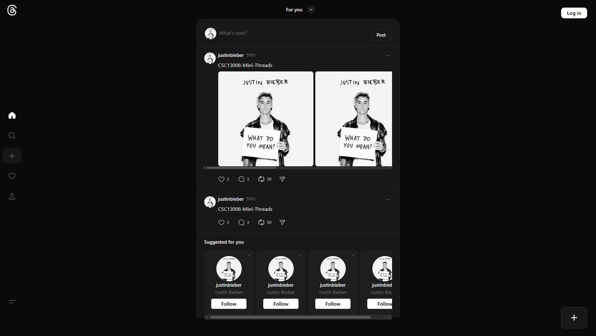

<div align="center">
  
  
  # Mini Threads
  
  *A simplified Threads clone*

  <div align="center">
    
  </div>
    
</div>

## Demo

**[Watch Demo](https://www.youtube.com/watch?v=RmAZqZE8T0Y)**

---

## Features

- **Authentication** - Sign up, login, password reset
- **User Profiles** - Edit profile, view user threads
- **Create Threads** - Text posts with optional images
- **Responsive Feed** - Home feed and explore all threads
- **Follow System** - Follow/unfollow users
- **Interactions** - Like and comment on threads
- **Notifications** - Follow, like, and comment alerts

---

## Tech Stack

### Frontend


### Backend


### Services & Tools


---

1. **Clone & Install**

   ```bash
   git clone https://github.com/JonasAugust12/CSC13008-Mini-Threads.git
   cd CSC13008-Mini-Threads
   npm install
   ```

2. **Setup Environment**

   ```bash
   cp .env.template .env
   # Fill in your environment variables
   ```

3. **Run the App**
   ```bash
   npm start
   ```
4. **Open** `http://localhost:3001`
